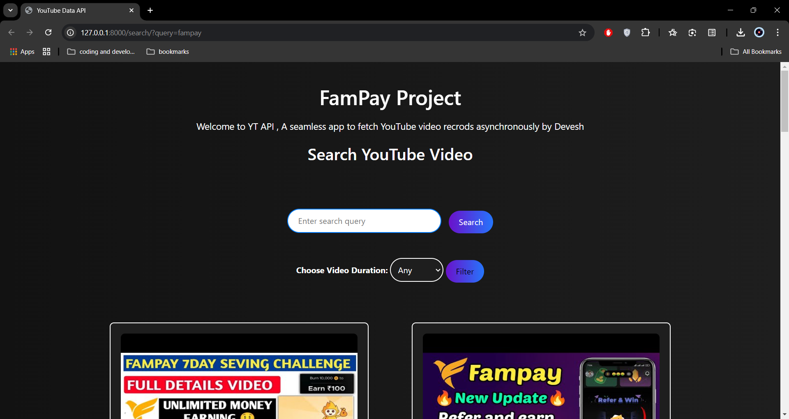
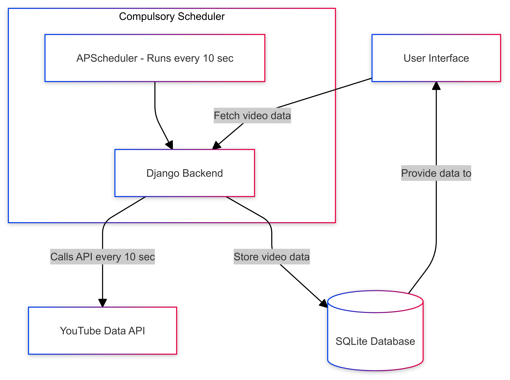
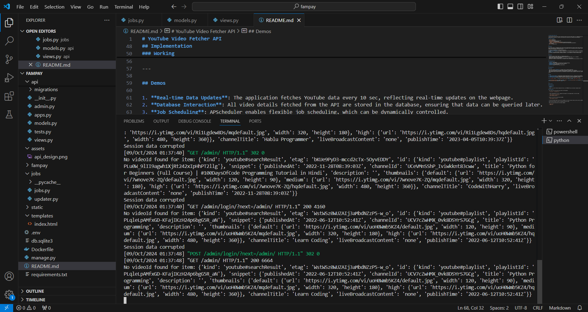
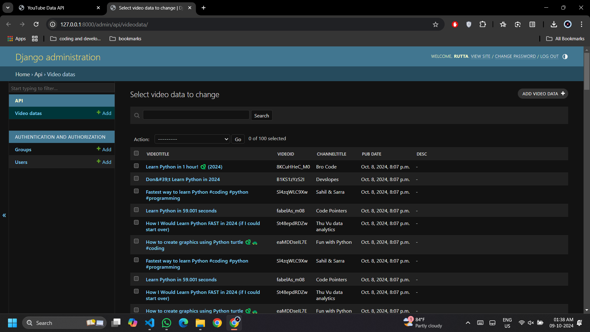
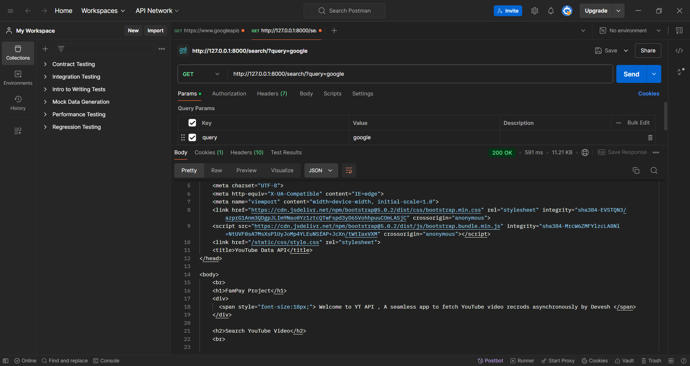
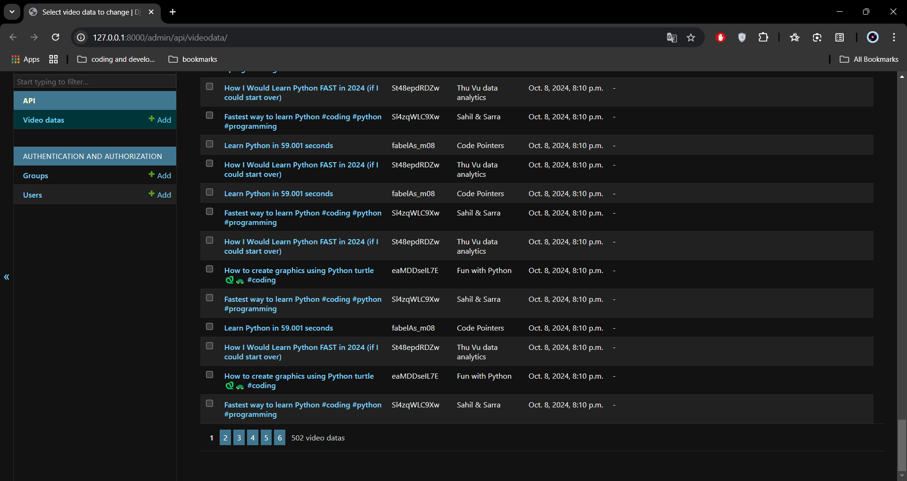
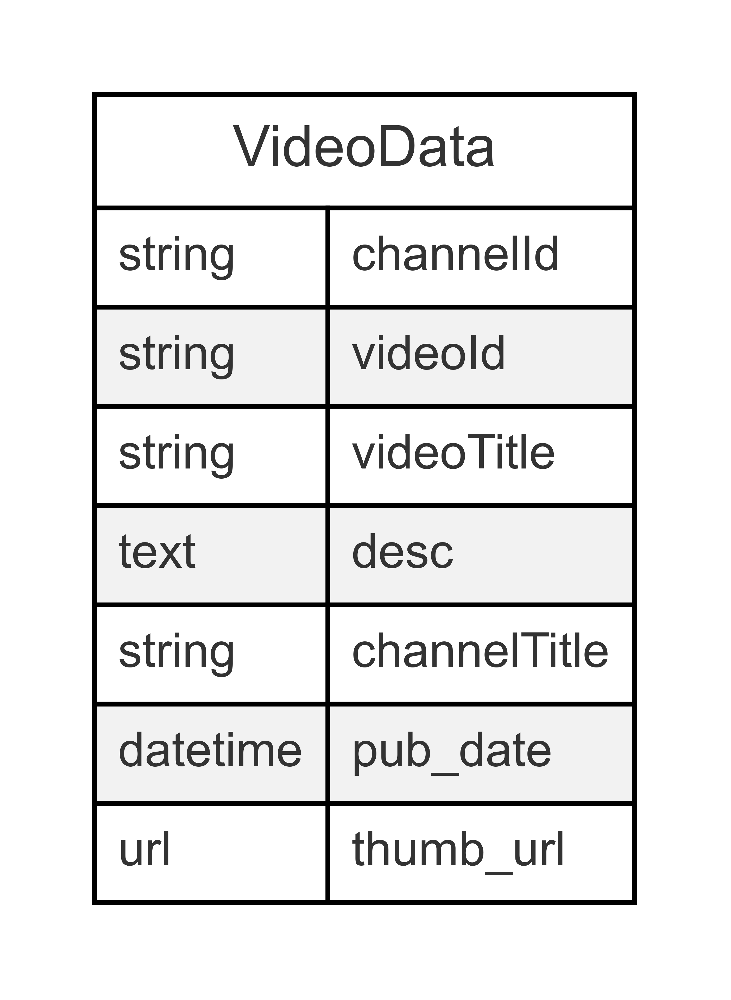

# YouTube Video Fetcher API

This project fetches the latest YouTube videos for a specified search query every 10 seconds using the YouTube Data API, ensuring real-time updates through scheduled tasks with APScheduler implemented through django.

## Table of Contents

- [Abstract](#abstract)
- [Features](#features)
- [Technologies Used](#technologies-used)
- [Implementation](#implementation)
- [Demos](#working)
- [How to Run](#how-to-run)

---

## Abstract

This project implements a background process designed to continuously fetch the latest video results from the YouTube Data API based on a predefined search query. Utilizing a scheduled task mechanism, the server makes API calls every 10 seconds, ensuring that the webpage displays real-time updates of the most recent videos. To enhance efficiency and simplify the scheduling of asynchronous jobs, the project employs APScheduler (Advanced Python Scheduler). APScheduler offers a robust solution for managing periodic tasks, allowing for seamless integration and improved performance in data retrieval. This approach not only ensures timely updates but also optimizes resource utilization, making it a suitable choice for applications requiring real-time data feeds.

---

## Features

- Fetches the latest YouTube videos for a predefined search query.
- Stores video details (title, description, published datetime, thumbnail URL, etc.) in a database.
- Updates data in real-time every 10 seconds.
- Supports job scheduling using APScheduler for more control over task intervals.
- Has options to search on a specific topic or by default retrive trending data and also has options to filter as per the video length.
- Supports the use of multiple Api keys

---

## Technologies Used

- **Python**: Core language.
- **Django**: Framework for the web application and database handling.
- **YouTube Data API**: Used to fetch the latest video data.
- **APScheduler**: scheduling jobs.
- **SQLite**: Database to store fetched video details.

---

## Implementation


- The server utilizes **APScheduler** to schedule jobs for fetching YouTube data.
- API calls to the YouTube API are executed every 10 seconds (this interval can be modified).
- Data, including video title, description, published datetime, thumbnails, etc., is processed and stored in the database.
- This approach provides enhanced control over scheduling, allowing for dynamic management of jobs (e.g., adding/removing jobs as needed).

---

## Working

1. **Real-time Data Updates**: The application fetches YouTube data every 10 sec, reflecting real-time updates on the webpage.
2. **Database Interaction**: All video details fetched from the API are stored in the database, ensuring that data can be queried later.
3. **Job Scheduling**: APScheduler enables flexible job scheduling, which can be dynamically controlled.

<br> <p  align = "center" >   </p>
<br>
<br>


  

<br>

---

## How to Run

### Prerequisites

- **Python 3.6+**
- **Django**

- create a  .env file to add your django secret key  and  YOUTUBE_API (you can add upto 4 apikeys atonce)

### Installation

- First load to the root directory and install the requirements 

``` pip install -r requirements.txt ```


-  Create createsuperuser with your credentials and migrate all the django models to save the schema 

``` python manage.py createsuperuser ```
``` python manage.py migrate ```


- Finally run the server using the below command 

``` python manage.py runserver ```


- To access the website head to http://127.0.0.1:8000/ and to access the data records use http://127.0.0.1:8000/admin

* Faster setup use Docker File that is attached along with the code:

- Move to the root directoy and run the below commands:  ``` docker build ``` and then use ``` docker up```

<br>

[Watch Demo Here](https://github.com/deveshruttala/async-yt-backend/raw/refs/heads/main/assets/demo_video.mp4)

<br>

  

<br>

* Done by Devesh